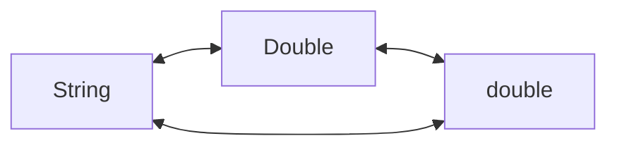

# Assignment 6 Soal 1

Buatlah sebuah program java converter type. Input bisa berupa String, Double, dan double kemudian bisa diconvert seperti gambar di bawah ini. Buat method tersendiri untuk tiap converter.

*Program dibuat dalam bentuk menu

